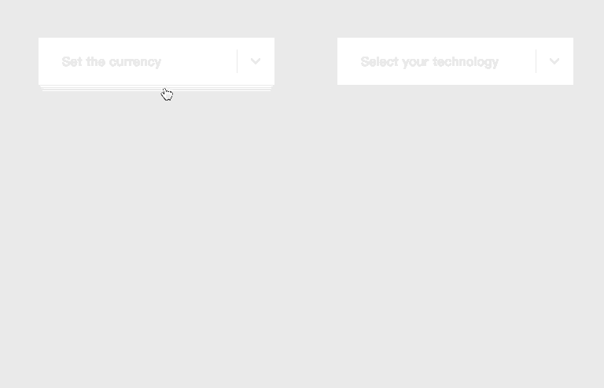

# effect-dropdown-react

[![NPM version][badge-npm-version]][url-npm]
[![Node version][badge-node-version]][url-npm]
[![NPM download][badge-npm-download]][url-npm]
![Dependencies][badge-dependencies]
![License][badge-license]

适用于 React 的优雅而炫酷的 Dropdown 组件。

[![NPM][image-npm]][url-npm]

**中文 | [English](./README_en.md)**

## 安装

```bash
$ npm i -S effect-dropdown-react # yarn add effect-dropdown-react
```

## 概览



[访问在线示例](https://xbt1.github.io/effect-dropdown-react/)

## 使用

一个简单的例子

`main.js`

```javascript
  import 'effect-dropdown-react/dist/index.css'
```

`App.jsx`

```javascript
  import { EffectDropdown, EffectDropdownItem } from 'effect-dropdown-react'

  export default () => {
    return (
      <EffectDropdown
        effect="camber"
        activeColor="#4d8c9d"
        label="Select your platform"
      >
        <EffectDropdownItem>Twitter</EffectDropdownItem>
        <EffectDropdownItem>Facebook</EffectDropdownItem>
        <EffectDropdownItem>Google+</EffectDropdownItem>
        <EffectDropdownItem>GitHub</EffectDropdownItem>
      </EffectDropdown>
    )
  }
```

详细使用方法见 [文档](./docs/usage.md) & [例子](./examples)

## Vue

[查看 Vue 版本](https://github.com/XBT1/effect-dropdown-vue)

## 开发

```bash
$ npm install
$ npm run dev
```

## 调试

```bash
$ npm run build:package
$ npm link ./
```

`App.jsx`

```javascript
  import { EffectDropdown, EffectDropdownItem } from 'effect-dropdown-react'
  import 'effect-dropdown-react/dist/index.css'
```

## 构建

```bash
$ npm run build:package # 构建 npm 包
$ npm run build:example # 构建示例站点
$ npm run build # build:package & build:example
```

## 更新日志

详见 [releases][url-releases]


[badge-npm-version]: https://img.shields.io/npm/v/effect-dropdown-react.svg
[badge-node-version]: https://img.shields.io/node/v/effect-dropdown-react.svg
[badge-npm-download]: https://img.shields.io/npm/dt/effect-dropdown-react.svg
[badge-license]: https://img.shields.io/github/license/XBT1/effect-dropdown-react.svg
[badge-dependencies]: https://img.shields.io/david/dev/XBT1/effect-dropdown-react.svg

[url-npm]: https://npmjs.org/package/effect-dropdown-react
[url-dependencies]: https://david-dm.org/vkbansal/effect-dropdown-react
[url-releases]: https://github.com/XBT1/effect-dropdown-react/releases

[image-npm]: https://nodei.co/npm/effect-dropdown-react.png
