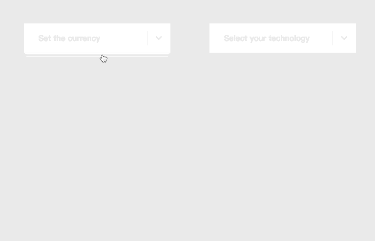

# effect-dropdown-react

[![NPM version][badge-npm-version]][url-npm]
[![Node version][badge-node-version]][url-npm]
[![NPM download][badge-npm-download]][url-npm]
![Dependencies][badge-dependencies]
![License][badge-license]

Simple effects of Dropdown for React.js.

[![NPM][image-npm]][url-npm]

**English | [中文](./README.md)**

## Installation

```bash
$ npm i -S effect-dropdown-react # yarn add effect-dropdown-react
```

## Gallery



[Go to online examples](https://xbt1.github.io/effect-dropdown-react/)

## Usage

A simple example

`main.js`

```javascript
  import 'effect-dropdown-react/dist/index.css'
```

`App.jsx`

```javascript
  import { EffectDropdown, EffectDropdownItem } from 'effect-dropdown-react'

  export default () => {
    return (
      <EffectDropdown
        effect="camber"
        activeColor="#4d8c9d"
        label="Select your platform"
      >
        <EffectDropdownItem>Twitter</EffectDropdownItem>
        <EffectDropdownItem>Facebook</EffectDropdownItem>
        <EffectDropdownItem>Google+</EffectDropdownItem>
        <EffectDropdownItem>GitHub</EffectDropdownItem>
      </EffectDropdown>
    )
  }
```

See [usage](./docs/usage-en.md) & [examples](./examples) for more details.

## Vue

[See Vue version](https://github.com/XBT1/effect-dropdown-vue)

## Develop

```bash
$ npm install
$ npm run dev
```

## Debug

```bash
$ npm run build:package
$ npm link ./
```

`App.jsx`

```javascript
  import { EffectDropdown, EffectDropdownItem } from 'effect-dropdown-react'
  import 'effect-dropdown-react/dist/index.css'
```

## Build

```bash
$ npm run build:package # Build for npm
$ npm run build:example # Build for site
$ npm run build # build:package & build:example
```

## Changelog

See [releases][url-releases]


[badge-npm-version]: https://img.shields.io/npm/v/effect-dropdown-react.svg
[badge-node-version]: https://img.shields.io/node/v/effect-dropdown-react.svg
[badge-npm-download]: https://img.shields.io/npm/dt/effect-dropdown-react.svg
[badge-license]: https://img.shields.io/github/license/XBT1/effect-dropdown-react.svg
[badge-dependencies]: https://img.shields.io/david/dev/XBT1/effect-dropdown-react.svg

[url-npm]: https://npmjs.org/package/effect-dropdown-react
[url-dependencies]: https://david-dm.org/vkbansal/effect-dropdown-react
[url-releases]: https://github.com/XBT1/effect-dropdown-react/releases

[image-npm]: https://nodei.co/npm/effect-dropdown-react.png
